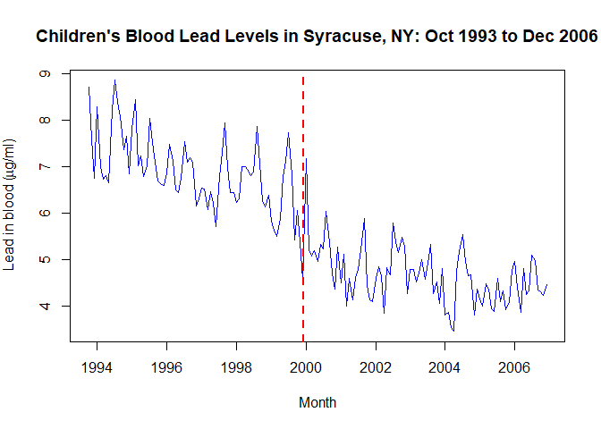
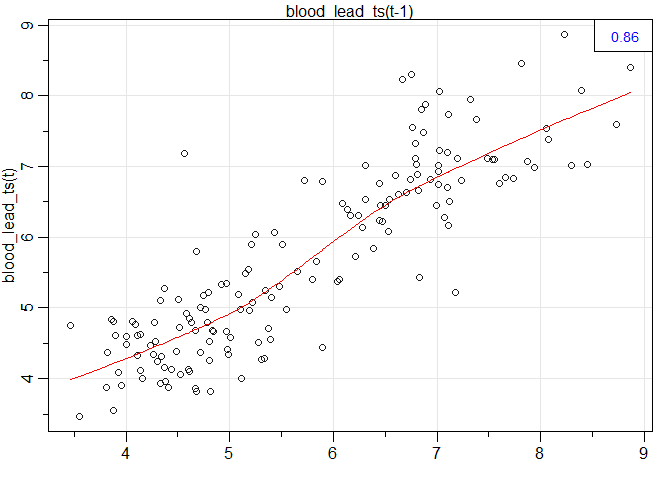
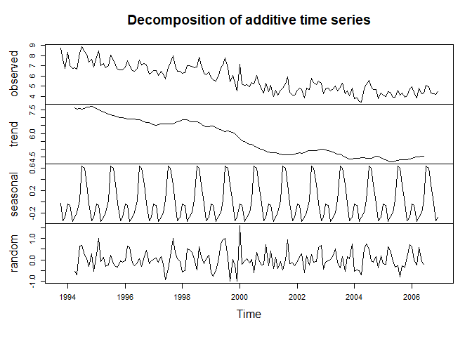
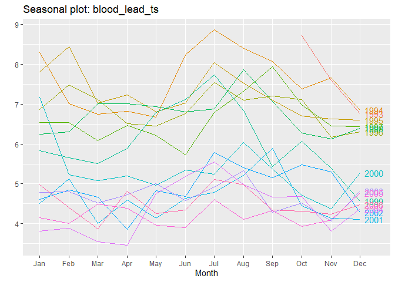
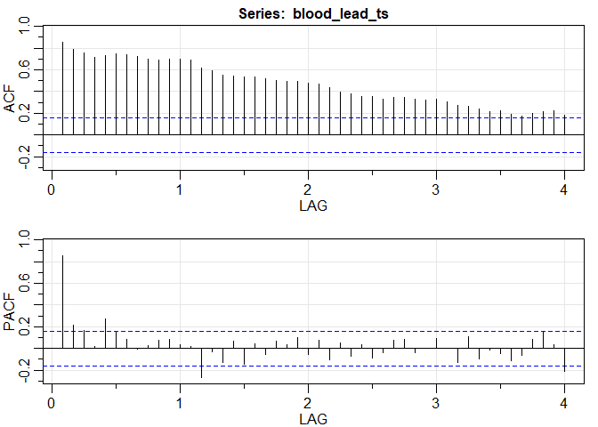
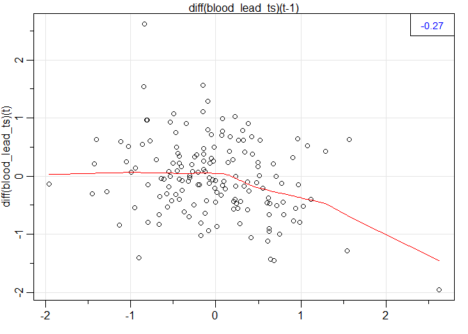
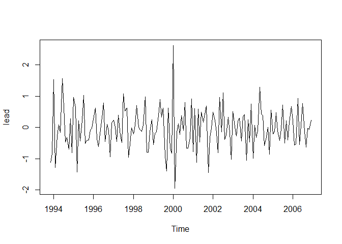
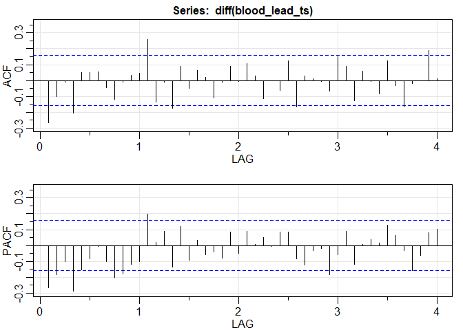
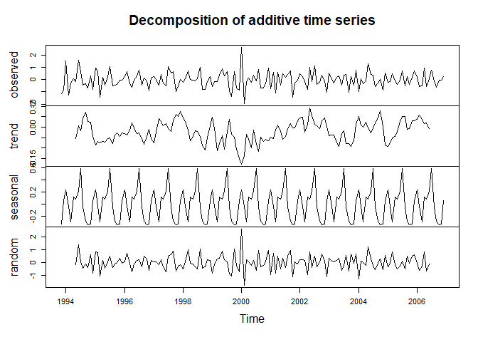
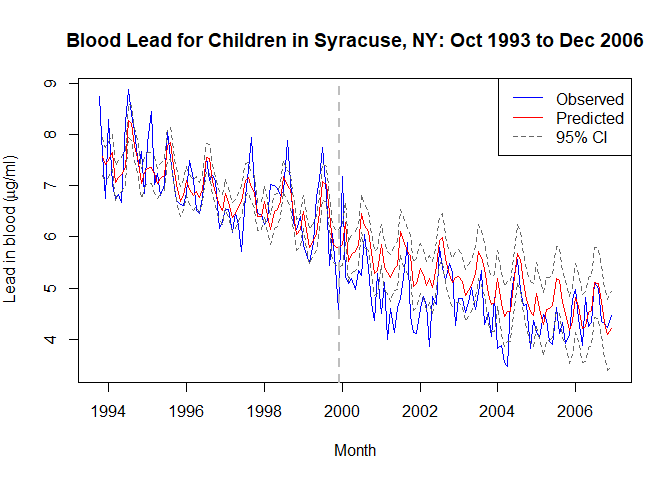

HDAT9700: Assignment 1B - Chapters 3 & 4
================
Andrea Schaffer
23 Sep 2019

### Submission instructions

This is an R Markdown document---an example of *literate programming*, an approach which allows users to interweave text, statistical output and the code that produces that output.

To complete your assignment:

-   Edit this file directly, interweaving text and R code as appropriate to answer the questions below. Remember to `Knit` the file to make sure everything is running smoothly. Detailed information on R Markdown is available [here](https://rmarkdown.rstudio.com/lesson-1.html), and there is a useful cheatsheet [here](https://www.rstudio.com/wp-content/uploads/2015/02/rmarkdown-cheatsheet.pdf).

-   Use git to `commit` changes you make in this repo locally.

-   `Push` the repo, together with this edited file and the corresponding `.md` file to GitHub Classroom.
    You can `commit` and `push` as often as neccessary---your assessment will be graded on the most recent version of your repo at the assessment due date.

Good luck!

------------------------------------------------------------------------

### Overview

For this assessment you will use a subset of data from a study of blood lead level in children in Syracuse, New York. ([Shao et al. (2017) Interrupted time series analysis of children's blood lead levels: A case study of lead hazard control program in Syracuse, New York. *PLoS ONE* 12(2):e0171778](https://journals.plos.org/plosone/article?id=10.1371/journal.pone.0171778)). Lead exposure in early childhood can lead to adverse behavioural and developmental outcomes. One of the main sources of exposure is lead-based paint, and is more common in low-income neighbourhoods.

The purpose of this study was to quantify long term trends in children's blood lead levels. The main outcome variable is monthly mean blood lead levels in *μ*g/ml measured in children living in Syracuse from October 1993 to December 2006. In December 1999, the city of Syracuse implemented a lead paint abatement project to remove lead from low income housing. In this assessment you will evaluate the impact of this intervention on mean blood lead levels in children over time.

The file contains the following variables:

-   **date** - Month and year
-   **bll** - Mean blood lead levels in *μ*g/ml
-   **time** - Time since start of study
-   **int** - Intervention variable (0=before intervention; 1=after intervention)
-   **time2** - Time since start of intervention

You will need to have the following packages installed: `astsa`, `lmtest`, `forecast`, and `zoo`.

The data are contained in your assignment repo and can be read as follows:

``` r
lead <- read.csv("lead.csv", header=TRUE)
head(lead)
```

    ##   ï..date     lead time int time2
    ## 1  Oct-93 8.729373    1   0     0
    ## 2  Nov-93 7.598978    2   0     0
    ## 3  Dec-93 6.756466    3   0     0
    ## 4  Jan-94 8.294782    4   0     0
    ## 5  Feb-94 7.013405    5   0     0
    ## 6  Mar-94 6.742232    6   0     0

``` r
library(astsa)
library(lmtest)
library(forecast)
library(zoo)
library(TSA)
```

------------------------------------------------------------------------

### Assessment questions

\*Hint: You may have to convert the data into 'ts' objects to complete this assignment.

#### (1) Create a plot of the mean blood lead levels time series, as if you were preparing it for inclusion in a report or publication. The date of the intervention should be clearly indicated. (10%)

``` r
blood_lead_ts <- ts(lead[2], start=c(1993,10), end=c(2006,12), frequency=12)

#print(time(blood_lead_ts))

plot(blood_lead_ts, 
    ylab= expression( "Lead in blood (" * mu * "g/ml)"),
    xlab="Month", 
    main= "Children's Blood Lead Levels in Syracuse, NY: Oct 1993 to Dec 2006",
    col= 'blue'
    )

# Add a vertical line - "col" is colour, "lty" is line type, "lwd" is line width
abline(v=1999.917, col="red", lty="dashed", lwd=2)
```



#### (2) Describe the characteristics of the blood lead levels time series in terms of the trend, seasonality, and outliers. Use plots and/or summary statistics to support your statements. (15%)

``` r
lag1.plot(blood_lead_ts)
```



``` r
# Plot the decomposed series
dec_lead <- decompose(blood_lead_ts)
plot(dec_lead)
```



``` r
#plot by year
ggseasonplot(blood_lead_ts, year.labels=TRUE)
```



``` r
acf2(blood_lead_ts)
```



    ##        ACF  PACF
    ##  [1,] 0.86  0.86
    ##  [2,] 0.79  0.21
    ##  [3,] 0.76  0.17
    ##  [4,] 0.71  0.02
    ##  [5,] 0.73  0.27
    ##  [6,] 0.74  0.15
    ##  [7,] 0.74  0.08
    ##  [8,] 0.72 -0.01
    ##  [9,] 0.70  0.03
    ## [10,] 0.69  0.08
    ## [11,] 0.70  0.08
    ## [12,] 0.70  0.04
    ## [13,] 0.69  0.02
    ## [14,] 0.62 -0.27
    ## [15,] 0.59 -0.03
    ## [16,] 0.55 -0.13
    ## [17,] 0.54  0.07
    ## [18,] 0.54 -0.14
    ## [19,] 0.53  0.04
    ## [20,] 0.52 -0.06
    ## [21,] 0.50  0.07
    ## [22,] 0.49  0.03
    ## [23,] 0.49  0.10
    ## [24,] 0.48 -0.06
    ## [25,] 0.47  0.07
    ## [26,] 0.43 -0.11
    ## [27,] 0.39  0.05
    ## [28,] 0.38 -0.07
    ## [29,] 0.36  0.04
    ## [30,] 0.36 -0.09
    ## [31,] 0.33 -0.04
    ## [32,] 0.35  0.07
    ## [33,] 0.34  0.08
    ## [34,] 0.33 -0.04
    ## [35,] 0.32  0.00
    ## [36,] 0.33  0.09
    ## [37,] 0.31  0.01
    ## [38,] 0.27 -0.13
    ## [39,] 0.26  0.11
    ## [40,] 0.24 -0.10
    ## [41,] 0.22 -0.01
    ## [42,] 0.22 -0.05
    ## [43,] 0.19 -0.11
    ## [44,] 0.17 -0.07
    ## [45,] 0.20  0.08
    ## [46,] 0.21  0.15
    ## [47,] 0.22  0.04
    ## [48,] 0.18 -0.21

``` r
summary(blood_lead_ts)
```

    ##       lead      
    ##  Min.   :3.462  
    ##  1st Qu.:4.604  
    ##  Median :5.400  
    ##  Mean   :5.719  
    ##  3rd Qu.:6.817  
    ##  Max.   :8.866

<span style="color:blue">**----------------------------------------------------------------**</span>
====================================================================================================

<span style="color:blue">**Below is to check for autocorrelation and seasonality after adjusting for the negative trend:**</span>



    ##         ACF  PACF
    ##  [1,] -0.27 -0.27
    ##  [2,] -0.10 -0.18
    ##  [3,] -0.01 -0.10
    ##  [4,] -0.20 -0.29
    ##  [5,]  0.05 -0.15
    ##  [6,]  0.05 -0.08
    ##  [7,]  0.05 -0.01
    ##  [8,] -0.04 -0.10
    ##  [9,] -0.12 -0.20
    ## [10,] -0.01 -0.18
    ## [11,]  0.03 -0.12
    ## [12,]  0.05 -0.10
    ## [13,]  0.26  0.20
    ## [14,] -0.13  0.02
    ## [15,] -0.01  0.09
    ## [16,] -0.17 -0.13
    ## [17,]  0.09  0.12
    ## [18,] -0.05 -0.09
    ## [19,]  0.07  0.03
    ## [20,]  0.02 -0.06
    ## [21,] -0.11 -0.04
    ## [22,] -0.01 -0.08
    ## [23,]  0.09  0.08
    ## [24,] -0.01 -0.05
    ## [25,]  0.11  0.09
    ## [26,]  0.03  0.01
    ## [27,] -0.11  0.05
    ## [28,]  0.00 -0.01
    ## [29,] -0.06  0.08
    ## [30,]  0.12  0.09
    ## [31,] -0.17 -0.08
    ## [32,]  0.03 -0.12
    ## [33,]  0.01 -0.03
    ## [34,]  0.00 -0.02
    ## [35,] -0.07 -0.18
    ## [36,]  0.15 -0.06
    ## [37,]  0.09  0.09
    ## [38,] -0.13 -0.12
    ## [39,]  0.06  0.01
    ## [40,] -0.01  0.04
    ## [41,] -0.09  0.02
    ## [42,]  0.13  0.13
    ## [43,] -0.03  0.06
    ## [44,] -0.17 -0.03
    ## [45,] -0.02 -0.16
    ## [46,]  0.00 -0.06
    ## [47,]  0.19  0.08
    ## [48,]  0.01  0.10



    ## Observation with max outlier: 75

    ## Date of max outlier: Dec-99

    ## Observation with min outlier: 76

    ## Date of min outlier: Jan-00

Looking at the raw data ploted in question one, there seems to be a negative trend. This is further confirmed by the trend of the decomposition time series.

There appears to be a step change around the time of the internvention and possibly a slope change, decreasing at a slower rate than before the intervention. The step change is further suported by the min outlier 1 month after the intervention, but there was also the max outlier the month of the intervention to be mindful of. The blood lead levels increasing at the start of the intervention may be the result of more lower income children being tested as a result of the intervention or a random anomoly.

Looking at the lag1 plot, you can see that there is high autocorrelation. After taking the difference (adjusting for the negative trend), there does not seem to be a need to correct for any seasonality, despite visually looking at the season plot there seems to be seasonality, as shown by the ACF and PACF plots being relatively within the blue lines (negliaible seasonality) and in fact when looking at the ACF and PACF plots after a 1 year lag as well, they seem to be worse; I would still look at models that accounted for yearly seasonality as the season plot visually suggests one.

#### (3) With time series data, it is important to test for autocorrelation, and adequately control for it if present. Briefly state how you might test for autocorrelation, and why it is important to adjust for it? (Note: there is no need to actually run the code) (10%)

lag1.plot('timeseries') is a good way to see if there is autocorrelation as demonstrated above. There is extremely high correlation, a diagonal line for the plots is shown, where after taking the difference from the previous month, there is no autocorrelation as shown from the second lag1 plot above. The average correlation is now 0, a horizonal line on average.

#### (4) Create the vectors listed below, checking that they were created correctly. Describe the purpose of each of these and when you would include them in your regression model? (15%)

    * **lag_int** - Intervention variable shifted by one month (i.e. starting in January 2000)
    * **lag_time2** - Time since intervention variable shifted by one month
    * **lag1_bll** - Mean blood lead level from the previous month
    * **month** - Dummy values for month.

We would use lag\_int when we think there is a step change, but the effect is seen after the intervention date - in this case we are setting up a one month delay.

We would use lag\_time2 when we suspect there is a slope change pre and post intervention, but again is delayed a month.

We would use lag1\_bll if the previous month's lead blood levels affect the next month's bll. To some degree, we do expect the bll's to correlate because it does take time for bll to reduce or increase to any continual stimulus or lack there of.

Month is a dummy variable used to account for the seasonality (months having a general trend); A more obvious use case would be when looking at drowning cases throughout the year, we see higher incidence of drowning in the summer when people are going to beaches and swimming more. With blood lead levels, it may correlate to kids being home more in the summer and december holidays, and getting more exposure to home lead sources.

**int ts:**

    ##      Jan Feb Mar Apr May Jun Jul Aug Sep Oct Nov Dec
    ## 1993                                       0   0   0
    ## 1994   0   0   0   0   0   0   0   0   0   0   0   0
    ## 1995   0   0   0   0   0   0   0   0   0   0   0   0
    ## 1996   0   0   0   0   0   0   0   0   0   0   0   0
    ## 1997   0   0   0   0   0   0   0   0   0   0   0   0
    ## 1998   0   0   0   0   0   0   0   0   0   0   0   0
    ## 1999   0   0   0   0   0   0   0   0   0   0   0   1
    ## 2000   1   1   1   1   1   1   1   1   1   1   1   1
    ## 2001   1   1   1   1   1   1   1   1   1   1   1   1
    ## 2002   1   1   1   1   1   1   1   1   1   1   1   1
    ## 2003   1   1   1   1   1   1   1   1   1   1   1   1
    ## 2004   1   1   1   1   1   1   1   1   1   1   1   1
    ## 2005   1   1   1   1   1   1   1   1   1   1   1   1
    ## 2006   1   1   1   1   1   1   1   1   1   1   1   1

**lag\_int ts:**

    ##      Jan Feb Mar Apr May Jun Jul Aug Sep Oct Nov Dec
    ## 1993                                       0   0   0
    ## 1994   0   0   0   0   0   0   0   0   0   0   0   0
    ## 1995   0   0   0   0   0   0   0   0   0   0   0   0
    ## 1996   0   0   0   0   0   0   0   0   0   0   0   0
    ## 1997   0   0   0   0   0   0   0   0   0   0   0   0
    ## 1998   0   0   0   0   0   0   0   0   0   0   0   0
    ## 1999   0   0   0   0   0   0   0   0   0   0   0   0
    ## 2000   1   1   1   1   1   1   1   1   1   1   1   1
    ## 2001   1   1   1   1   1   1   1   1   1   1   1   1
    ## 2002   1   1   1   1   1   1   1   1   1   1   1   1
    ## 2003   1   1   1   1   1   1   1   1   1   1   1   1
    ## 2004   1   1   1   1   1   1   1   1   1   1   1   1
    ## 2005   1   1   1   1   1   1   1   1   1   1   1   1
    ## 2006   1   1   1   1   1   1   1   1   1   1   1   1

**time2 ts:**

    ##      Jan Feb Mar Apr May Jun Jul Aug Sep Oct Nov Dec
    ## 1993                                       0   0   0
    ## 1994   0   0   0   0   0   0   0   0   0   0   0   0
    ## 1995   0   0   0   0   0   0   0   0   0   0   0   0
    ## 1996   0   0   0   0   0   0   0   0   0   0   0   0
    ## 1997   0   0   0   0   0   0   0   0   0   0   0   0
    ## 1998   0   0   0   0   0   0   0   0   0   0   0   0
    ## 1999   0   0   0   0   0   0   0   0   0   0   0   1
    ## 2000   2   3   4   5   6   7   8   9  10  11  12  13
    ## 2001  14  15  16  17  18  19  20  21  22  23  24  25
    ## 2002  26  27  28  29  30  31  32  33  34  35  36  37
    ## 2003  38  39  40  41  42  43  44  45  46  47  48  49
    ## 2004  50  51  52  53  54  55  56  57  58  59  60  61
    ## 2005  62  63  64  65  66  67  68  69  70  71  72  73
    ## 2006  74  75  76  77  78  79  80  81  82  83  84  85

**lag\_time2 ts:**

    ##      Jan Feb Mar Apr May Jun Jul Aug Sep Oct Nov Dec
    ## 1993                                       0   0   0
    ## 1994   0   0   0   0   0   0   0   0   0   0   0   0
    ## 1995   0   0   0   0   0   0   0   0   0   0   0   0
    ## 1996   0   0   0   0   0   0   0   0   0   0   0   0
    ## 1997   0   0   0   0   0   0   0   0   0   0   0   0
    ## 1998   0   0   0   0   0   0   0   0   0   0   0   0
    ## 1999   0   0   0   0   0   0   0   0   0   0   0   0
    ## 2000   1   2   3   4   5   6   7   8   9  10  11  12
    ## 2001  13  14  15  16  17  18  19  20  21  22  23  24
    ## 2002  25  26  27  28  29  30  31  32  33  34  35  36
    ## 2003  37  38  39  40  41  42  43  44  45  46  47  48
    ## 2004  49  50  51  52  53  54  55  56  57  58  59  60
    ## 2005  61  62  63  64  65  66  67  68  69  70  71  72
    ## 2006  73  74  75  76  77  78  79  80  81  82  83  84

**bll ts:**

    ##           Jan      Feb      Mar      Apr      May      Jun      Jul
    ## 1993                                                               
    ## 1994 8.294782 7.013405 6.742232 6.820510 6.666275 8.233997 8.866014
    ## 1995 7.811869 8.451024 7.024977 7.232733 6.801850 7.027077 8.053036
    ## 1996 6.867658 7.486555 7.116774 6.505546 6.448595 6.759882 7.550718
    ## 1997 6.538750 6.533746 6.085235 6.471981 6.214966 5.723100 6.796245
    ## 1998 6.238348 6.310181 7.014937 7.010086 6.935602 6.812658 6.887018
    ## 1999 5.839500 5.650194 5.508020 5.891001 6.792198 7.114867 7.739024
    ## 2000 7.179620 5.220227 5.080266 5.193225 4.967886 5.340167 5.244831
    ## 2001 4.505909 5.117792 4.001118 4.598485 4.135183 4.629984 4.790557
    ## 2002 4.608719 4.844531 4.667286 3.861482 4.831074 4.680337 5.795261
    ## 2003 4.788623 4.800611 4.519057 4.722073 5.011122 4.579881 4.922029
    ## 2004 3.812985 3.877870 3.552647 3.461846 4.747927 5.175875 5.549715
    ## 2005 4.154771 4.007875 4.488603 4.380201 3.954886 3.898317 4.612642
    ## 2006 4.977274 4.407158 3.874387 4.808975 4.259604 4.335548 5.106440
    ##           Aug      Sep      Oct      Nov      Dec
    ## 1993                   8.729373 7.598978 6.756466
    ## 1994 8.395929 8.080282 7.379209 7.665268 6.850767
    ## 1995 7.533779 7.104899 6.706661 6.631385 6.603572
    ## 1996 7.099987 7.197573 7.109005 6.165634 6.307747
    ## 1997 7.319165 7.942905 6.990841 6.451559 6.443132
    ## 1998 7.871979 7.072210 6.276782 6.134913 6.390104
    ## 1999 6.833640 5.433267 6.062931 5.395426 4.559365
    ## 2000 6.041833 5.375315 4.713067 4.366968 5.278953
    ## 2001 5.214325 5.895197 4.440881 4.136289 4.112584
    ## 2002 5.399726 5.153162 5.480484 5.304414 4.277138
    ## 2003 5.334574 4.280267 4.525168 4.058963 4.809472
    ## 2004 4.971823 4.668688 4.678811 3.817326 4.367142
    ## 2005 4.107112 4.328434 3.926302 4.092434 4.768938
    ## 2006 4.983766 4.344213 4.307104 4.239429 4.468900

**lag1\_bll ts:**

    ##           Jan      Feb      Mar      Apr      May      Jun      Jul
    ## 1993                                                               
    ## 1994 6.756466 8.294782 7.013405 6.742232 6.820510 6.666275 8.233997
    ## 1995 6.850767 7.811869 8.451024 7.024977 7.232733 6.801850 7.027077
    ## 1996 6.603572 6.867658 7.486555 7.116774 6.505546 6.448595 6.759882
    ## 1997 6.307747 6.538750 6.533746 6.085235 6.471981 6.214966 5.723100
    ## 1998 6.443132 6.238348 6.310181 7.014937 7.010086 6.935602 6.812658
    ## 1999 6.390104 5.839500 5.650194 5.508020 5.891001 6.792198 7.114867
    ## 2000 4.559365 7.179620 5.220227 5.080266 5.193225 4.967886 5.340167
    ## 2001 5.278953 4.505909 5.117792 4.001118 4.598485 4.135183 4.629984
    ## 2002 4.112584 4.608719 4.844531 4.667286 3.861482 4.831074 4.680337
    ## 2003 4.277138 4.788623 4.800611 4.519057 4.722073 5.011122 4.579881
    ## 2004 4.809472 3.812985 3.877870 3.552647 3.461846 4.747927 5.175875
    ## 2005 4.367142 4.154771 4.007875 4.488603 4.380201 3.954886 3.898317
    ## 2006 4.768938 4.977274 4.407158 3.874387 4.808975 4.259604 4.335548
    ##           Aug      Sep      Oct      Nov      Dec
    ## 1993                         NA 8.729373 7.598978
    ## 1994 8.866014 8.395929 8.080282 7.379209 7.665268
    ## 1995 8.053036 7.533779 7.104899 6.706661 6.631385
    ## 1996 7.550718 7.099987 7.197573 7.109005 6.165634
    ## 1997 6.796245 7.319165 7.942905 6.990841 6.451559
    ## 1998 6.887018 7.871979 7.072210 6.276782 6.134913
    ## 1999 7.739024 6.833640 5.433267 6.062931 5.395426
    ## 2000 5.244831 6.041833 5.375315 4.713067 4.366968
    ## 2001 4.790557 5.214325 5.895197 4.440881 4.136289
    ## 2002 5.795261 5.399726 5.153162 5.480484 5.304414
    ## 2003 4.922029 5.334574 4.280267 4.525168 4.058963
    ## 2004 5.549715 4.971823 4.668688 4.678811 3.817326
    ## 2005 4.612642 4.107112 4.328434 3.926302 4.092434
    ## 2006 5.106440 4.983766 4.344213 4.307104 4.239429

**month**

    ##   [1] October   November  December  January   February  March     April    
    ##   [8] May       June      July      August    September October   November 
    ##  [15] December  January   February  March     April     May       June     
    ##  [22] July      August    September October   November  December  January  
    ##  [29] February  March     April     May       June      July      August   
    ##  [36] September October   November  December  January   February  March    
    ##  [43] April     May       June      July      August    September October  
    ##  [50] November  December  January   February  March     April     May      
    ##  [57] June      July      August    September October   November  December 
    ##  [64] January   February  March     April     May       June      July     
    ##  [71] August    September October   November  December  January   February 
    ##  [78] March     April     May       June      July      August    September
    ##  [85] October   November  December  January   February  March     April    
    ##  [92] May       June      July      August    September October   November 
    ##  [99] December  January   February  March     April     May       June     
    ## [106] July      August    September October   November  December  January  
    ## [113] February  March     April     May       June      July      August   
    ## [120] September October   November  December  January   February  March    
    ## [127] April     May       June      July      August    September October  
    ## [134] November  December  January   February  March     April     May      
    ## [141] June      July      August    September October   November  December 
    ## [148] January   February  March     April     May       June      July     
    ## [155] August    September October   November  December 
    ## 12 Levels: January February March April May June July August ... December

#### (5) Fit the following regression models. Which one best describes the association between the intervention, and children's mean blood lead levels over time? Justify your answer. (25%)

    * **Model 1** - bll ~ time + int + time2
    * **Model 2** - bll ~ time + int + time2 + month
    * **Model 3** - bll ~ time + int + time2 + month + lag1_bll
    * **Model 4** - bll ~ time + lag_int + lag_time2 + month
    * **Model 5** - bll ~ time + lag_int + lag_time2 + month + lag1_bll 

#### **Model 1**


    ## 
    ##  Durbin-Watson test
    ## 
    ## data:  bll_model1
    ## DW = 1.2552, p-value = 3.335e-07
    ## alternative hypothesis: true autocorrelation is greater than 0

    ## 
    ## Call:
    ## glm(formula = bll ~ time + int + time2)
    ## 
    ## Deviance Residuals: 
    ##      Min        1Q    Median        3Q       Max  
    ## -1.10190  -0.44854  -0.04942   0.37041   2.07629  
    ## 
    ## Coefficients:
    ##              Estimate Std. Error t value Pr(>|t|)    
    ## (Intercept)  7.696085   0.137717  55.883  < 2e-16 ***
    ## time        -0.020574   0.003191  -6.447 1.37e-09 ***
    ## int         -1.049150   0.186226  -5.634 8.10e-08 ***
    ## time2        0.009994   0.004111   2.431   0.0162 *  
    ## ---
    ## Signif. codes:  0 '***' 0.001 '**' 0.01 '*' 0.05 '.' 0.1 ' ' 1
    ## 
    ## (Dispersion parameter for gaussian family taken to be 0.3438039)
    ## 
    ##     Null deviance: 274.48  on 158  degrees of freedom
    ## Residual deviance:  53.29  on 155  degrees of freedom
    ## AIC: 287.41
    ## 
    ## Number of Fisher Scoring iterations: 2

    ## Waiting for profiling to be done...

    ##                    2.5 %      97.5 %
    ## (Intercept)  7.426165225  7.96600433
    ## time        -0.026828007 -0.01431919
    ## int         -1.414146626 -0.68415294
    ## time2        0.001935766  0.01805133

#### **Model 2**


    ## 
    ##  Durbin-Watson test
    ## 
    ## data:  bll_model2
    ## DW = 1.4565, p-value = 0.0002399
    ## alternative hypothesis: true autocorrelation is greater than 0

    ## 
    ## Call:
    ## glm(formula = bll ~ time + int + time2 + month)
    ## 
    ## Deviance Residuals: 
    ##      Min        1Q    Median        3Q       Max  
    ## -1.06028  -0.35530  -0.04822   0.30984   2.01792  
    ## 
    ## Coefficients:
    ##                 Estimate Std. Error t value Pr(>|t|)    
    ## (Intercept)     7.781208   0.178116  43.686  < 2e-16 ***
    ## time           -0.021711   0.002776  -7.821 1.02e-12 ***
    ## int            -0.990902   0.162318  -6.105 9.07e-09 ***
    ## time2           0.010714   0.003570   3.001  0.00317 ** 
    ## monthFebruary  -0.130030   0.199405  -0.652  0.51538    
    ## monthMarch     -0.425290   0.199428  -2.133  0.03466 *  
    ## monthApril     -0.310686   0.199467  -1.558  0.12153    
    ## monthMay       -0.232511   0.199522  -1.165  0.24581    
    ## monthJune      -0.020837   0.199593  -0.104  0.91700    
    ## monthJuly       0.579862   0.199679   2.904  0.00427 ** 
    ## monthAugust     0.533813   0.199781   2.672  0.00841 ** 
    ## monthSeptember  0.224276   0.199899   1.122  0.26375    
    ## monthOctober   -0.013319   0.196152  -0.068  0.94596    
    ## monthNovember  -0.373224   0.196249  -1.902  0.05920 .  
    ## monthDecember  -0.291478   0.195918  -1.488  0.13900    
    ## ---
    ## Signif. codes:  0 '***' 0.001 '**' 0.01 '*' 0.05 '.' 0.1 ' ' 1
    ## 
    ## (Dispersion parameter for gaussian family taken to be 0.2584341)
    ## 
    ##     Null deviance: 274.476  on 158  degrees of freedom
    ## Residual deviance:  37.215  on 144  degrees of freedom
    ## AIC: 252.32
    ## 
    ## Number of Fisher Scoring iterations: 2

    ## Waiting for profiling to be done...

    ##                       2.5 %      97.5 %
    ## (Intercept)     7.432107149  8.13030972
    ## time           -0.027151806 -0.01627003
    ## int            -1.309039872 -0.67276384
    ## time2           0.003717237  0.01770980
    ## monthFebruary  -0.520855983  0.26079594
    ## monthMarch     -0.816162230 -0.03441798
    ## monthApril     -0.701635147  0.08026296
    ## monthMay       -0.623568078  0.15854537
    ## monthJune      -0.412031897  0.37035833
    ## monthJuly       0.188497921  0.97122631
    ## monthAugust     0.142248624  0.92537647
    ## monthSeptember -0.167518488  0.61607001
    ## monthOctober   -0.397770081  0.37113292
    ## monthNovember  -0.757864281  0.01141640
    ## monthDecember  -0.675470003  0.09251371

#### **Model 3**


    ## 
    ##  Durbin-Watson test
    ## 
    ## data:  bll_model3
    ## DW = 2.0015, p-value = 0.4263
    ## alternative hypothesis: true autocorrelation is greater than 0

    ## 
    ## Call:
    ## glm(formula = bll ~ time + int + time2 + month + lag1_bll)
    ## 
    ## Deviance Residuals: 
    ##      Min        1Q    Median        3Q       Max  
    ## -1.05022  -0.31681  -0.04539   0.24904   2.08985  
    ## 
    ## Coefficients:
    ##                 Estimate Std. Error t value Pr(>|t|)    
    ## (Intercept)     5.883198   0.622869   9.445  < 2e-16 ***
    ## time           -0.015250   0.003213  -4.746  5.0e-06 ***
    ## int            -0.778821   0.175415  -4.440  1.8e-05 ***
    ## time2           0.007259   0.003549   2.045  0.04268 *  
    ## monthFebruary  -0.212663   0.193343  -1.100  0.27322    
    ## monthMarch     -0.476350   0.192211  -2.478  0.01437 *  
    ## monthApril     -0.289224   0.191716  -1.509  0.13362    
    ## monthMay       -0.240100   0.191631  -1.253  0.21229    
    ## monthJune      -0.048449   0.191860  -0.253  0.80100    
    ## monthJuly       0.499143   0.193403   2.581  0.01087 *  
    ## monthAugust     0.303579   0.205390   1.478  0.14161    
    ## monthSeptember  0.004805   0.204217   0.024  0.98126    
    ## monthOctober   -0.232361   0.197271  -1.178  0.24082    
    ## monthNovember  -0.454789   0.190235  -2.391  0.01813 *  
    ## monthDecember  -0.299435   0.188175  -1.591  0.11378    
    ## lag1_bll        0.247819   0.080280   3.087  0.00243 ** 
    ## ---
    ## Signif. codes:  0 '***' 0.001 '**' 0.01 '*' 0.05 '.' 0.1 ' ' 1
    ## 
    ## (Dispersion parameter for gaussian family taken to be 0.2383683)
    ## 
    ##     Null deviance: 265.356  on 157  degrees of freedom
    ## Residual deviance:  33.848  on 142  degrees of freedom
    ##   (1 observation deleted due to missingness)
    ## AIC: 238.95
    ## 
    ## Number of Fisher Scoring iterations: 2

    ## Waiting for profiling to be done...

    ##                        2.5 %       97.5 %
    ## (Intercept)     4.6623964286  7.103999098
    ## time           -0.0215477079 -0.008952811
    ## int            -1.1226274586 -0.435014813
    ## time2           0.0003024337  0.014215720
    ## monthFebruary  -0.5916089234  0.166281942
    ## monthMarch     -0.8530766929 -0.099622365
    ## monthApril     -0.6649817741  0.086533019
    ## monthMay       -0.6156898327  0.135488884
    ## monthJune      -0.4244870079  0.327589234
    ## monthJuly       0.1200808103  0.878205736
    ## monthAugust    -0.0989774496  0.706136391
    ## monthSeptember -0.3954528629  0.405062474
    ## monthOctober   -0.6190042247  0.154282808
    ## monthNovember  -0.8276423210 -0.081936302
    ## monthDecember  -0.6682509178  0.069381531
    ## lag1_bll        0.0904726555  0.405164711

#### **Model 4**


    ## 
    ##  Durbin-Watson test
    ## 
    ## data:  bll_model4
    ## DW = 1.5473, p-value = 0.001658
    ## alternative hypothesis: true autocorrelation is greater than 0

    ## 
    ## Call:
    ## glm(formula = bll ~ time + lag_int + lag_time2 + month)
    ## 
    ## Deviance Residuals: 
    ##      Min        1Q    Median        3Q       Max  
    ## -1.17259  -0.35467  -0.04615   0.31929   2.00202  
    ## 
    ## Coefficients:
    ##                 Estimate Std. Error t value Pr(>|t|)    
    ## (Intercept)     7.818802   0.180801  43.245  < 2e-16 ***
    ## time           -0.023076   0.002770  -8.330 5.79e-14 ***
    ## lag_int        -0.899302   0.165391  -5.437 2.26e-07 ***
    ## lag_time2       0.011846   0.003620   3.272  0.00134 ** 
    ## monthFebruary  -0.129275   0.203223  -0.636  0.52570    
    ## monthMarch     -0.423781   0.203247  -2.085  0.03883 *  
    ## monthApril     -0.308422   0.203287  -1.517  0.13141    
    ## monthMay       -0.229492   0.203342  -1.129  0.26094    
    ## monthJune      -0.017063   0.203414  -0.084  0.93327    
    ## monthJuly       0.584391   0.203502   2.872  0.00470 ** 
    ## monthAugust     0.539096   0.203606   2.648  0.00901 ** 
    ## monthSeptember  0.230314   0.203725   1.131  0.26014    
    ## monthOctober   -0.009599   0.199920  -0.048  0.96177    
    ## monthNovember  -0.368706   0.200019  -1.843  0.06733 .  
    ## monthDecember  -0.356175   0.200135  -1.780  0.07724 .  
    ## ---
    ## Signif. codes:  0 '***' 0.001 '**' 0.01 '*' 0.05 '.' 0.1 ' ' 1
    ## 
    ## (Dispersion parameter for gaussian family taken to be 0.2684258)
    ## 
    ##     Null deviance: 274.476  on 158  degrees of freedom
    ## Residual deviance:  38.653  on 144  degrees of freedom
    ## AIC: 258.35
    ## 
    ## Number of Fisher Scoring iterations: 2

    ## Waiting for profiling to be done...

    ##                       2.5 %      97.5 %
    ## (Intercept)     7.464438183  8.17316502
    ## time           -0.028505288 -0.01764591
    ## lag_int        -1.223461224 -0.57514183
    ## lag_time2       0.004751026  0.01894154
    ## monthFebruary  -0.527584729  0.26903415
    ## monthMarch     -0.822136998 -0.02542429
    ## monthApril     -0.706856440  0.09001264
    ## monthMay       -0.628036397  0.16905154
    ## monthJune      -0.415747745  0.38162150
    ## monthJuly       0.185534043  0.98324697
    ## monthAugust     0.140036215  0.93815512
    ## monthSeptember -0.168979928  0.62960715
    ## monthOctober   -0.401434335  0.38223647
    ## monthNovember  -0.760736111  0.02332413
    ## monthDecember  -0.748432488  0.03608179

#### **Model 5**


    ## 
    ##  Durbin-Watson test
    ## 
    ## data:  bll_model5
    ## DW = 2.1031, p-value = 0.6671
    ## alternative hypothesis: true autocorrelation is greater than 0

    ## 
    ## Call:
    ## glm(formula = bll ~ time + lag_int + lag_time2 + month + lag1_bll)
    ## 
    ## Deviance Residuals: 
    ##      Min        1Q    Median        3Q       Max  
    ## -1.09672  -0.32426  -0.05565   0.25890   2.07527  
    ## 
    ## Coefficients:
    ##                 Estimate Std. Error t value Pr(>|t|)    
    ## (Intercept)     5.766922   0.635233   9.078 8.41e-16 ***
    ## time           -0.016131   0.003241  -4.977 1.84e-06 ***
    ## lag_int        -0.667262   0.177974  -3.749 0.000257 ***
    ## lag_time2       0.008020   0.003608   2.223 0.027808 *  
    ## monthFebruary  -0.218595   0.196586  -1.112 0.268036    
    ## monthMarch     -0.478842   0.195433  -2.450 0.015495 *  
    ## monthApril     -0.284919   0.194929  -1.462 0.146046    
    ## monthMay       -0.237330   0.194841  -1.218 0.225218    
    ## monthJune      -0.046473   0.195074  -0.238 0.812045    
    ## monthJuly       0.497610   0.196645   2.531 0.012480 *  
    ## monthAugust     0.290628   0.208853   1.392 0.166236    
    ## monthSeptember -0.006416   0.207657  -0.031 0.975396    
    ## monthOctober   -0.236493   0.200582  -1.179 0.240357    
    ## monthNovember  -0.456221   0.193421  -2.359 0.019702 *  
    ## monthDecember  -0.347827   0.191788  -1.814 0.071851 .  
    ## lag1_bll        0.268152   0.081698   3.282 0.001296 ** 
    ## ---
    ## Signif. codes:  0 '***' 0.001 '**' 0.01 '*' 0.05 '.' 0.1 ' ' 1
    ## 
    ## (Dispersion parameter for gaussian family taken to be 0.2464239)
    ## 
    ##     Null deviance: 265.356  on 157  degrees of freedom
    ## Residual deviance:  34.992  on 142  degrees of freedom
    ##   (1 observation deleted due to missingness)
    ## AIC: 244.2
    ## 
    ## Number of Fisher Scoring iterations: 2

    ## Waiting for profiling to be done...

    ##                        2.5 %       97.5 %
    ## (Intercept)     4.5218887512  7.011954439
    ## time           -0.0224833482 -0.009777955
    ## lag_int        -1.0160841512 -0.318439127
    ## lag_time2       0.0009483937  0.015090938
    ## monthFebruary  -0.6038967229  0.166706592
    ## monthMarch     -0.8618841530 -0.095800279
    ## monthApril     -0.6669724910  0.097135366
    ## monthMay       -0.6192118741  0.144552068
    ## monthJune      -0.4288108979  0.335865209
    ## monthJuly       0.1121933525  0.883027330
    ## monthAugust    -0.1187158712  0.699970976
    ## monthSeptember -0.4134159901  0.400584400
    ## monthOctober   -0.6296257902  0.156640750
    ## monthNovember  -0.8353194935 -0.077122190
    ## monthDecember  -0.7237256716  0.028071199
    ## lag1_bll        0.1080274377  0.428275827

Model 3 is the best model based on the Durbin-Watson test, AIC and model simplicity. First and foremost the model has to have negligible autocorrelation as detectable by the Durbin-Watson test. A p-value above .05, rejecting the null hypothesis is required for using a linear regresion model on interrupted time series.

**P-values for DW test:**
Model 1: 3.335e-07
Model 2: 0.0002399
Model 3: 0.4263
Model 4: 0.001658
Model 5: 0.6671

Because negligable autocorrelation is one of the assumptions for using a linear regression model on ITS, model 3 and model 5 are the only ones that can be considered. This makes sense because lag1\_bll is equivalent to diff, which i showed in question 2 was essential to cancel out the correlation to the previous month.

**AIC for regression models:**
Model 3 (bll ~ time + int + time2 + month + lag1\_bll): 238.95
Model 5 (bll ~ time + lag\_int + lag\_time2 + month + lag1\_bll): 244.2

Despite looking at the graph and seeing what appears to be a lag, the model that does not have a lag for the intervention has a lower AIC of 238.95 and is therefore the better model.

Because there are 2 seemingly obvious outliers at time of intervention and the month after, I would probably want to remove those 2 observations from the time series all together and then I believe a lag model would fit better. As it is, I think the 2 extremes are averaging out in the model that is not lagged.

#### (6) Using the model chosen in (5), what can you conclude about the effect of the intervention? Provide effect estimates and relevant statistics to support your answer. (15%)

The Coefficient estimates for model 3 (time + int + time2 + month + lag1\_bll) show a significant step change lower -.78 meaning that blood lead levels decreased .78 micrograms per ml hg as a dirrect result of the intervention. Month dummy variable coefficients do show adjustments based on the month (with January, June, July, August and September being the highest months), but previous month's bll seems to to be more statistically significant with a p value of .0024 and a coefficient of .25. Time shows that there is a general negative trend with a coefficient of -.015 and time2 shows that the slope is less (though still negative) with a coefficient of .007.

#### (7) Including a "negative control" series is one way of improving causal inference from interrupted time series analysis. Suggest an appropriate control series for this intervention, and justify your choice. (10%)

A negative control series that I would use for this intervention would be a nearby city with simialer blood levels that did not recieve the intervention. A good candidate might be buffolo NY or Ithaca NY both being upstate, but still being somewhat metropolitan.

You would expect these groups of people to be acting similarly and therefore any change seen in one group that was not seen in the other shows stronger evidence for the effectiveness, or lack of effectiveness, for the intervention.

Below I also plot an approximate counterfactual (removing int, the step change, but not time2, the slope change, coefficients for the intervention). A counterfactual is not as good as a negative control, but gives a sense of what a negative control of the same population might look like assuming there were not any other unseen factors affecting blood lead levels.

**Approximation of a counterfactual - readjusts assuming no step change or change of slope** 

------------------------------------------------------------------------

### Student declaration

***Instructions: Indicate that you understand and agree with the following three statements by typing an x in the square brackets below, e.g. \[x\].***

I declare that this assessment item is my own work, except where acknowledged, and has not been submitted for academic credit elsewhere or previously, or produced independently of this course (e.g. for a third party such as your place of employment) and acknowledge that the assessor of this item may, for the purpose of assessing this item: (i) Reproduce this assessment item and provide a copy to another member of the University; and/or (ii) Communicate a copy of this assessment item to a plagiarism checking service (which may then retain a copy of the assessment item on its database for the purpose of future plagiarism checking).

-   \[x\] I understand and agree

I certify that I have read and understood the University Rules in respect of Student Academic Misconduct.

-   \[x\] I understand and agree

I have a backup copy of the assessment.
- \[x\] I understand and agree
